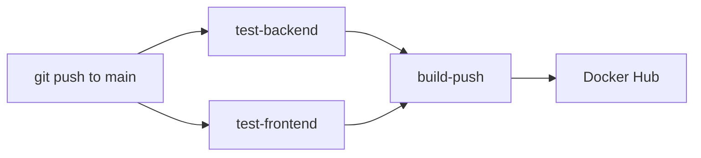

# 🚀 CI/CD Setup — GitHub Actions

Your CI/CD pipeline is ready! Here's everything that was set up.

---

## Files Created

| File | Purpose |
|------|---------|
| [ci.yml](file:///c:/Users/rishi/Desktop/Projects/Deepfake-Detection-main/.github/workflows/ci.yml) | GitHub Actions workflow — 3 jobs |
| [tests.py](file:///c:/Users/rishi/Desktop/Projects/Deepfake-Detection-main/Backend/deepfake_backend/detection/tests.py) | Django tests for Detection model + API |
| [.gitignore](file:///c:/Users/rishi/Desktop/Projects/Deepfake-Detection-main/.gitignore) | Updated to exclude pycache, node_modules, PDFs, etc. |

---

## CI Pipeline Architecture



## 3 Jobs in the Workflow

### Job 1: `test-backend`
- Spins up **PostgreSQL 16** as a service container
- Installs Python 3.14 + dependencies
- Runs `python manage.py migrate`
- Runs `python manage.py test`

### Job 2: `test-frontend`
- Sets up Node.js 20 with npm caching
- Runs `npm install`
- Runs `npm run build`

### Job 3: `build-push` (runs only if both tests pass)
- Logs into Docker Hub
- Builds + pushes `deepfake-backend:latest`
- Builds + pushes `deepfake-frontend:latest`

---

## GitHub Secrets Required

> [!IMPORTANT]
> You must add these secrets in your GitHub repo → **Settings → Secrets and variables → Actions**

| Secret | Description |
|--------|-------------|
| `POSTGRES_PASSWORD` | Your PostgreSQL password (e.g., `abhi@1289`) |
| `SECRET_KEY` | Django SECRET_KEY from settings.py |
| `DOCKER_USERNAME` | Your Docker Hub username |
| `DOCKER_TOKEN` | Docker Hub access token ([create here](https://hub.docker.com/settings/security)) |

---

## Next Steps

### 1. Create a GitHub Repository
Go to [github.com/new](https://github.com/new) and create a new repo.

### 2. Push Your Code
```powershell
cd c:\Users\rishi\Desktop\Projects\Deepfake-Detection-main
git remote add origin https://github.com/YOUR_USERNAME/Deepfake-Detection.git
git push -u origin main
```

### 3. Add GitHub Secrets
Go to your repo → Settings → Secrets and variables → Actions → **New repository secret**

### 4. Watch It Run
After pushing, go to **Actions** tab to see the workflow execute!

- ✅ Green tick = all jobs passed
- ❌ Red cross = click to see which step failed
- 🟡 Yellow circle = currently running

---

## Django Tests Written

```python
# 5 test cases for the Detection model:
✅ test_detection_creation        — Verifies object creates correctly
✅ test_detection_str             — Tests __str__ representation
✅ test_prediction_max_length     — Checks field max_length is 10
✅ test_prediction_exceed_max     — Validates exceeding max_length raises error
✅ test_user_cascade_delete       — Confirms cascade delete works

# 2 API tests:
✅ test_history_requires_auth     — History endpoint needs authentication
✅ test_upload_requires_auth      — Upload endpoint needs authentication
```
