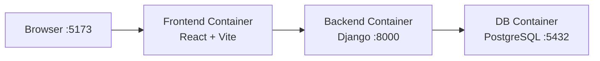

# 🐳 Docker Setup — Deepfake Detection Project

Your project has been fully Dockerized! Here's what was created and how to use it.

---

## Files Created

| File | Purpose |
|------|---------|
| [Dockerfile](file:///c:/Users/rishi/Desktop/Projects/Deepfake-Detection-main/Backend/deepfake_backend/Dockerfile) | Backend — Python 3.14-slim, Django server |
| [.dockerignore](file:///c:/Users/rishi/Desktop/Projects/Deepfake-Detection-main/Backend/deepfake_backend/.dockerignore) | Backend — excludes __pycache__, venv, etc. |
| [requirements.txt](file:///c:/Users/rishi/Desktop/Projects/Deepfake-Detection-main/Backend/deepfake_backend/requirements.txt) | Backend — Python dependencies |
| [Dockerfile](file:///c:/Users/rishi/Desktop/Projects/Deepfake-Detection-main/Frontend/Dockerfile) | Frontend — Node 20-alpine, Vite dev server |
| [.dockerignore](file:///c:/Users/rishi/Desktop/Projects/Deepfake-Detection-main/Frontend/.dockerignore) | Frontend — excludes node_modules, dist |
| [docker-compose.yml](file:///c:/Users/rishi/Desktop/Projects/Deepfake-Detection-main/docker-compose.yml) | Orchestrates all 3 services |

## Files Modified

```diff:settings.py
"""
Django settings for deepfake_backend project.

Generated by 'django-admin startproject' using Django 6.0.2.

For more information on this file, see
https://docs.djangoproject.com/en/6.0/topics/settings/

For the full list of settings and their values, see
https://docs.djangoproject.com/en/6.0/ref/settings/
"""

from pathlib import Path

# Build paths inside the project like this: BASE_DIR / 'subdir'.
BASE_DIR = Path(__file__).resolve().parent.parent


# Quick-start development settings - unsuitable for production
# See https://docs.djangoproject.com/en/6.0/howto/deployment/checklist/

# SECURITY WARNING: keep the secret key used in production secret!
SECRET_KEY = 'django-insecure-sb$=*8)a&)vjnw@0+%m+ppf33c%g0t!vy8u@oeq#yshio@ik_m'

# SECURITY WARNING: don't run with debug turned on in production!
DEBUG = True

ALLOWED_HOSTS = []


# Application definition

INSTALLED_APPS = [
    'django.contrib.admin',
    'django.contrib.auth',
    'django.contrib.contenttypes',
    'django.contrib.sessions',
    'django.contrib.messages',
    'django.contrib.staticfiles',
    'corsheaders',
    'rest_framework',
    'accounts',
    'detection.apps.DetectionConfig',
]

MIDDLEWARE = [
    'corsheaders.middleware.CorsMiddleware',
    'django.middleware.security.SecurityMiddleware',
    'django.contrib.sessions.middleware.SessionMiddleware',
    'django.middleware.common.CommonMiddleware',
    'django.middleware.csrf.CsrfViewMiddleware',
    'django.contrib.auth.middleware.AuthenticationMiddleware',
    'django.contrib.messages.middleware.MessageMiddleware',
    'django.middleware.clickjacking.XFrameOptionsMiddleware',
]

ROOT_URLCONF = 'deepfake_backend.urls'

TEMPLATES = [
    {
        'BACKEND': 'django.template.backends.django.DjangoTemplates',
        'DIRS': [],
        'APP_DIRS': True,
        'OPTIONS': {
            'context_processors': [
                'django.template.context_processors.request',
                'django.contrib.auth.context_processors.auth',
                'django.contrib.messages.context_processors.messages',
            ],
        },
    },
]

WSGI_APPLICATION = 'deepfake_backend.wsgi.application'


# Database
# https://docs.djangoproject.com/en/6.0/ref/settings/#databases

DATABASES = {
    'default': {
        'ENGINE': 'django.db.backends.postgresql',
        'NAME': 'lms_db',
        'USER': 'lms_user',
        'PASSWORD': 'abhi@1289',  # TODO: Update with your actual lms_user password
        'HOST': 'localhost',
        'PORT': '5432',
    }
}


# Password validation
# https://docs.djangoproject.com/en/6.0/ref/settings/#auth-password-validators

AUTH_PASSWORD_VALIDATORS = [
    {
        'NAME': 'django.contrib.auth.password_validation.UserAttributeSimilarityValidator',
    },
    {
        'NAME': 'django.contrib.auth.password_validation.MinimumLengthValidator',
    },
    {
        'NAME': 'django.contrib.auth.password_validation.CommonPasswordValidator',
    },
    {
        'NAME': 'django.contrib.auth.password_validation.NumericPasswordValidator',
    },
]


# Internationalization
# https://docs.djangoproject.com/en/6.0/topics/i18n/

LANGUAGE_CODE = 'en-us'

TIME_ZONE = 'UTC'

USE_I18N = True

USE_TZ = True


# Static files (CSS, JavaScript, Images)
# https://docs.djangoproject.com/en/6.0/howto/static-files/

STATIC_URL = 'static/'


import os

MEDIA_URL = '/media/'
MEDIA_ROOT = os.path.join(BASE_DIR, 'media')

from datetime import timedelta

# REST_FRAMEWORK = {
#     'DEFAULT_AUTHENTICATION_CLASSES': (
#         'rest_framework_simplejwt.authentication.JWTAuthentication',
#     ),
# }/
REST_FRAMEWORK = {
    'DEFAULT_AUTHENTICATION_CLASSES': (
        'rest_framework.authentication.SessionAuthentication', # For browsable API
        'rest_framework_simplejwt.authentication.JWTAuthentication',
    ),
}

SIMPLE_JWT = {
    'ACCESS_TOKEN_LIFETIME': timedelta(days=1),
    'REFRESH_TOKEN_LIFETIME': timedelta(days=1),
}

CORS_ALLOWED_ORIGINS = [
    'http://localhost:5173',
    'http://127.0.0.1:5173',
]

===
"""
Django settings for deepfake_backend project.

Generated by 'django-admin startproject' using Django 6.0.2.

For more information on this file, see
https://docs.djangoproject.com/en/6.0/topics/settings/

For the full list of settings and their values, see
https://docs.djangoproject.com/en/6.0/ref/settings/
"""

from pathlib import Path

# Build paths inside the project like this: BASE_DIR / 'subdir'.
BASE_DIR = Path(__file__).resolve().parent.parent


# Quick-start development settings - unsuitable for production
# See https://docs.djangoproject.com/en/6.0/howto/deployment/checklist/

# SECURITY WARNING: keep the secret key used in production secret!
SECRET_KEY = 'django-insecure-sb$=*8)a&)vjnw@0+%m+ppf33c%g0t!vy8u@oeq#yshio@ik_m'

# SECURITY WARNING: don't run with debug turned on in production!
DEBUG = True

ALLOWED_HOSTS = ['*']


# Application definition

INSTALLED_APPS = [
    'django.contrib.admin',
    'django.contrib.auth',
    'django.contrib.contenttypes',
    'django.contrib.sessions',
    'django.contrib.messages',
    'django.contrib.staticfiles',
    'corsheaders',
    'rest_framework',
    'accounts',
    'detection.apps.DetectionConfig',
]

MIDDLEWARE = [
    'corsheaders.middleware.CorsMiddleware',
    'django.middleware.security.SecurityMiddleware',
    'django.contrib.sessions.middleware.SessionMiddleware',
    'django.middleware.common.CommonMiddleware',
    'django.middleware.csrf.CsrfViewMiddleware',
    'django.contrib.auth.middleware.AuthenticationMiddleware',
    'django.contrib.messages.middleware.MessageMiddleware',
    'django.middleware.clickjacking.XFrameOptionsMiddleware',
]

ROOT_URLCONF = 'deepfake_backend.urls'

TEMPLATES = [
    {
        'BACKEND': 'django.template.backends.django.DjangoTemplates',
        'DIRS': [],
        'APP_DIRS': True,
        'OPTIONS': {
            'context_processors': [
                'django.template.context_processors.request',
                'django.contrib.auth.context_processors.auth',
                'django.contrib.messages.context_processors.messages',
            ],
        },
    },
]

WSGI_APPLICATION = 'deepfake_backend.wsgi.application'


# Database
# https://docs.djangoproject.com/en/6.0/ref/settings/#databases

import os

DATABASES = {
    'default': {
        'ENGINE': 'django.db.backends.postgresql',
        'NAME': os.environ.get('POSTGRES_DB', 'lms_db'),
        'USER': os.environ.get('POSTGRES_USER', 'lms_user'),
        'PASSWORD': os.environ.get('POSTGRES_PASSWORD', 'abhi@1289'),
        'HOST': os.environ.get('POSTGRES_HOST', 'localhost'),
        'PORT': os.environ.get('POSTGRES_PORT', '5432'),
    }
}


# Password validation
# https://docs.djangoproject.com/en/6.0/ref/settings/#auth-password-validators

AUTH_PASSWORD_VALIDATORS = [
    {
        'NAME': 'django.contrib.auth.password_validation.UserAttributeSimilarityValidator',
    },
    {
        'NAME': 'django.contrib.auth.password_validation.MinimumLengthValidator',
    },
    {
        'NAME': 'django.contrib.auth.password_validation.CommonPasswordValidator',
    },
    {
        'NAME': 'django.contrib.auth.password_validation.NumericPasswordValidator',
    },
]


# Internationalization
# https://docs.djangoproject.com/en/6.0/topics/i18n/

LANGUAGE_CODE = 'en-us'

TIME_ZONE = 'UTC'

USE_I18N = True

USE_TZ = True


# Static files (CSS, JavaScript, Images)
# https://docs.djangoproject.com/en/6.0/howto/static-files/

STATIC_URL = 'static/'


import os

MEDIA_URL = '/media/'
MEDIA_ROOT = os.path.join(BASE_DIR, 'media')

from datetime import timedelta

# REST_FRAMEWORK = {
#     'DEFAULT_AUTHENTICATION_CLASSES': (
#         'rest_framework_simplejwt.authentication.JWTAuthentication',
#     ),
# }/
REST_FRAMEWORK = {
    'DEFAULT_AUTHENTICATION_CLASSES': (
        'rest_framework.authentication.SessionAuthentication', # For browsable API
        'rest_framework_simplejwt.authentication.JWTAuthentication',
    ),
}

SIMPLE_JWT = {
    'ACCESS_TOKEN_LIFETIME': timedelta(days=1),
    'REFRESH_TOKEN_LIFETIME': timedelta(days=1),
}

CORS_ALLOWED_ORIGINS = [
    'http://localhost:5173',
    'http://127.0.0.1:5173',
    'http://frontend:5173',
]

```

---

## Architecture



## 3 Services in Docker Compose

| Service | Image | Port Mapping |
|---------|-------|-------------|
| **db** | `postgres:16` | 5433 → 5432 |
| **backend** | Built from `Backend/deepfake_backend/Dockerfile` | 8000 → 8000 |
| **frontend** | Built from `Frontend/Dockerfile` | 5173 → 5173 |

---

## How to Run

### Prerequisites
1. **Docker Desktop** installed and running (green "Engine running" icon)
2. **WSL 2** enabled (Windows)

### Step 1 — Stop local servers
Stop your currently running `python manage.py runserver` and `npm run dev` processes.

### Step 2 — Build & Start everything
```powershell
cd c:\Users\rishi\Desktop\Projects\Deepfake-Detection-main
docker compose up -d
```

### Step 3 — Run migrations (first time only)
```powershell
docker compose exec backend python manage.py migrate
docker compose exec backend python manage.py createsuperuser
```

### Step 4 — Verify
- **Frontend:** http://localhost:5173
- **Backend API:** http://localhost:8000/api/
- **Django Admin:** http://localhost:8000/admin/

### Useful Commands
```powershell
# View logs
docker compose logs -f

# View logs for specific service
docker compose logs -f backend

# Stop all containers
docker compose down

# Rebuild after code changes
docker compose up -d --build

# Access backend shell
docker compose exec backend python manage.py shell
```

---

> [!IMPORTANT]
> The **model.pth** file (16MB) is inside `Backend/deepfake_backend/model/` and will be copied into the Docker image. This is fine for development but for production you'd want to use a volume mount or download it at runtime.

> [!NOTE]
> The PostgreSQL port is mapped to **5433** on your host to avoid conflicts with your local PostgreSQL running on 5432. Once you stop local Postgres, you can change it to `5432:5432` in the compose file.
