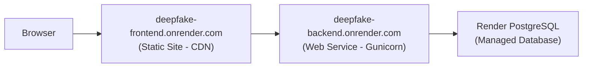

# 🚀 Render Deployment Guide

Your code is **ready and pushed** to GitHub. Now follow these steps on [render.com](https://render.com).

---

## Files Created/Modified for Render

| File | What Changed |
|------|-------------|
| [settings.py](file:///c:/Users/rishi/Desktop/Projects/Deepfake-Detection-main/Backend/deepfake_backend/deepfake_backend/settings.py) | `dj_database_url`, WhiteNoise, CORS, CSRF, cookie settings for production |
| [build.sh](file:///c:/Users/rishi/Desktop/Projects/Deepfake-Detection-main/Backend/deepfake_backend/build.sh) | Build script: installs deps, collectstatic, migrate |
| [requirements.txt](file:///c:/Users/rishi/Desktop/Projects/Deepfake-Detection-main/Backend/deepfake_backend/requirements.txt) | Added `gunicorn`, `whitenoise`, `dj-database-url` |
| [_redirects](file:///c:/Users/rishi/Desktop/Projects/Deepfake-Detection-main/Frontend/public/_redirects) | Client-side routing fix for React Router |

---

## Deployment Steps

### Step 1: Create PostgreSQL Database
1. Go to [render.com](https://render.com) → **New** → **PostgreSQL**
2. Configure:
   - **Name:** `deepfake-database`
   - **Database:** `lms_db`
   - **User:** `lms_user`
   - **Region:** Choose closest to you
   - **Plan:** Free
3. Click **Create Database**
4. **Copy the Internal Database URL** — you'll need it next

---

### Step 2: Create Django Web Service
1. Click **New** → **Web Service**
2. Connect your GitHub repo: `abhinav-dasari/Deepfake_Detection`
3. Configure:

| Setting | Value |
|---------|-------|
| Name | `deepfake-backend` |
| Region | Same as database |
| Branch | `main` |
| Root Directory | `Backend/deepfake_backend` |
| Runtime | Python 3 |
| Build Command | `pip install -r requirements.txt && python manage.py collectstatic --noinput && python manage.py migrate` |
| Start Command | `gunicorn deepfake_backend.wsgi` |
| Plan | Free |

4. Add **Environment Variables**:

| Variable | Value |
|----------|-------|
| `SECRET_KEY` | Generate a random long string |
| `DEBUG` | `False` |
| `DATABASE_URL` | *(paste Internal Database URL from Step 1)* |
| `RENDER_EXTERNAL_HOSTNAME` | `deepfake-backend.onrender.com` |
| `RENDER_FRONTEND_URL` | `https://deepfake-frontend.onrender.com` |

5. Click **Create Web Service**

---

### Step 3: Migrate Data to Render PostgreSQL

```bash
# 1. Dump local database
pg_dump -U lms_user -d lms_db > backup.sql

# 2. Get External Database URL from Render Dashboard → PostgreSQL → Info tab
# 3. Restore to Render
psql <EXTERNAL_DATABASE_URL> -f backup.sql

# 4. Verify
psql <EXTERNAL_DATABASE_URL>
\dt
SELECT COUNT(*) FROM auth_user;
\q
```

---

### Step 4: Deploy React as Static Site
1. Click **New** → **Static Site**
2. Connect same GitHub repo
3. Configure:

| Setting | Value |
|---------|-------|
| Name | `deepfake-frontend` |
| Branch | `main` |
| Root Directory | `Frontend` |
| Build Command | `npm install && npm run build` |
| Publish Directory | `dist` |

4. Add **Environment Variable**:

| Variable | Value |
|----------|-------|
| `VITE_API_URL` | `https://deepfake-backend.onrender.com/api` |

5. Click **Create Static Site**

---

### Step 5: Verify Everything

- ✅ Visit `https://deepfake-backend.onrender.com/admin`
- ✅ Visit `https://deepfake-frontend.onrender.com`
- ✅ Test login and registration

> [!IMPORTANT]
> If you need to create a superuser, go to Render Dashboard → your backend service → **Shell** tab → run `python manage.py createsuperuser`

---

## Architecture on Render



## Auto-Deploy
Every `git push origin main` triggers automatic redeployment on Render! 🔄
